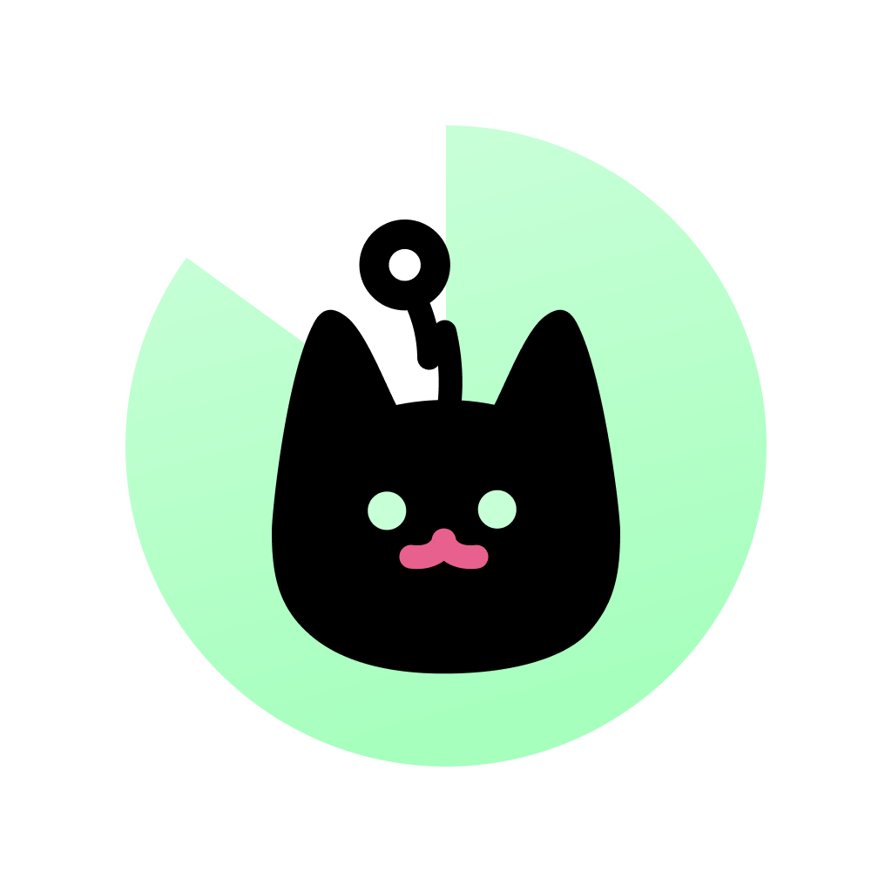

# NeowFocus 🐱⏱️

<div align="center">



**귀여운 고양이와 함께하는 뽀모도로 타이머**

[](https://www.electronjs.org/)
[](https://reactjs.org/)
[](https://www.typescriptlang.org/)
[](https://www.apple.com/app-store/)

**[English](./README.md)** | **[한국어](#)**

</div>

---

## 🎯 소개

NeowFocus는 macOS용 뽀모도로 타이머 애플리케이션입니다. 집중 세션을 완료할 때마다 귀여운 고양이 발바닥 도장을 찍어가며 생산적인 하루를 만들어보세요!

## ✨ 주요 기능

- 🎯 **뽀모도로 타이머**: 25분 집중 세션으로 효율적인 시간 관리
- 🐾 **발바닥 애니메이션**: 세션 완료 시 고양이 발바닥 도장 효과
- 📌 **항상 위 모드**: 화면 최상단에 고정되는 플로팅 타이머
- 🪟 **Tiny Window**: 최소화된 미니 뷰로 공간 절약
- 🎨 **세련된 디자인**: Figma 기반 디자인 시스템 적용
- 💾 **자동 저장**: 작업 내역과 타이머 상태 자동 저장
- 🔔 **시스템 트레이**: 메뉴바 상주 및 빠른 접근
- ⌨️ **키보드 단축키**:
  - `Cmd+W`로 창 숨기기
  - `Cmd+Q`로 앱 종료
  - 집중 모드에서 특정 단축키 비활성화로 방해 최소화
- 🌙 **다크 모드**: macOS 네이티브 다크 테마 지원
- 🍎 **Mac App Store 지원**: 샌드박스 완전 준수

## 📱 사용 방법

### 1. 집중 세션 시작
- 응용 프로그램 폴더나 메뉴바에서 NeowFocus 실행
- 작업명 입력 (선택사항)
- 타이머를 클릭하여 25분 집중 세션 시작

### 2. 집중 중
- 타이머가 항상 화면 위에 표시되어 남은 시간 확인 가능
- Tiny Window 모드로 전환하여 최소화된 화면으로 전환
- 집중 모드가 실수로 인한 방해를 방지

### 3. 세션 완료
- 타이머가 종료되면 귀여운 고양이 발바닥 도장 애니메이션 표시
- 세션을 완료할수록 발바닥 도장 수집
- 진행 상황이 자동으로 저장됨

### 4. 시스템 트레이
- 트레이 아이콘 클릭으로 메인 창 표시/숨기기
- 우클릭으로 메뉴 옵션 빠른 접근
- Dock 메뉴에서 열기, 숨기기, 종료

## 🛠 기술 스택

- **프레임워크**: Electron 28.x + React 18.x
- **언어**: TypeScript 5.x
- **빌드 도구**: Vite + electron-vite + @electron/forge
- **스타일링**: styled-components + 테마 시스템
- **상태 관리**: React Context API + localStorage
- **패키징**: Apple 공식 @electron/forge

## 🔒 개인정보 보호 및 권한

NeowFocus는 개인정보를 존중합니다:
- ✅ **데이터 수집 없음**: 작업과 타이머 데이터는 기기에만 저장됩니다
- ✅ **네트워크 요청 없음**: 완전히 오프라인으로 작동합니다
- ✅ **서드파티 분석 없음**: 추적이나 원격 측정이 전혀 없습니다
- ✅ **샌드박스**: Mac App Store 보안 요구사항 완전 준수
- ✅ **백그라운드 서비스 없음**: 사용 중일 때만 실행됩니다

### 필요한 권한
- **없음**: NeowFocus는 특별한 권한이 필요하지 않습니다

## 🚀 설치

### Mac App Store에서 설치 (권장)
Mac App Store에 곧 출시 예정입니다!

### 수동 설치
```bash
# 저장소 클론
git clone https://github.com/your-repo/NeowFocus.git

# 의존성 설치
pnpm install

# 개발 모드 실행
pnpm run dev

# 프로덕션 빌드
pnpm run build:mas
```

## 💡 팁

- **키보드 단축키**: `Cmd+W`를 눌러 빠르게 창을 숨기고 작업으로 복귀
- **Tiny Window**: 작업 공간을 차단하지 않고 시간을 추적하기에 완벽
- **메뉴바 접근**: 트레이 아이콘을 언제든지 클릭하여 창 다시 표시
- **작업 지속성**: 마지막 작업명이 자동으로 저장되고 복원됩니다

## 🆘 지원

문제가 발생하거나 질문이 있으시면:

- 📧 이메일: <ahhancom@gmail.com>
- 🐛 버그 제보: [GitHub Issues](https://github.com/jxxh204/NeowFocus/issues)
- 💬 토론: [GitHub Discussions](https://github.com/jxxh204/NeowFocus/discussions)

## 🔐 개인정보처리방침

- [개인정보처리방침](PRIVACY_POLICY_URL) - 여기에 링크를 넣어주세요

## 📋 시스템 요구사항

- macOS 11.0 (Big Sur) 이상
- Apple Silicon (M1/M2/M3) 또는 Intel 프로세서
- 100 MB 여유 디스크 공간

## 📄 라이선스

Copyright © 2025 NeowFocus. All rights reserved.

## 🤝 기여

버그 리포트나 기능 제안은 GitHub Issues를 통해 환영합니다.

---

<div align="center">

Made with ❤️ and 🐱

**Version 1.1.0**

</div>
