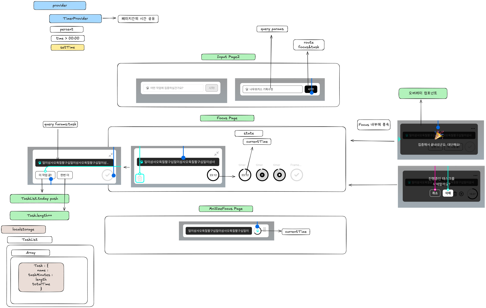

# NeowFocus 🐱⏱️

> 귀여운 고양이와 함께하는 뽀모도로 타이머 데스크탑 애플리케이션


## 소개

NeowFocus는 Electron 기반의 뽀모도로 타이머 애플리케이션입니다. 귀여운 고양이 도장을 찍으며 집중력을 높이고 보람찬 하루를 만들어보세요!

### 주요 기능

- 🎯 **뽀모도로 타이머**: 25분 집중 세션 관리
- 🐱 **고양이 테마 UI**: 귀여운 고양이 캐릭터와 함께
- 📌 **항상 위 모드**: 화면 최상단에 고정되는 플로팅 타이머
- 🎨 **미니멀 디자인**: 384×60px 컴팩트 사이즈 (확장 가능)
- 💾 **세션 저장**: 로컬 스토리지를 통한 작업 내역 저장
- 🔔 **시스템 트레이**: 백그라운드 실행 지원

## 기술 스택

- **프레임워크**: Electron 28.x
- **UI**: React 18.x + TypeScript
- **빌드 도구**: Vite + electron-vite
- **스타일링**: styled-components
- **라우팅**: react-router-dom
- **패키징**: electron-builder

## 시작하기

### 필수 요구사항

- Node.js 18.x 이상
- pnpm (권장) 또는 npm

### 설치 및 실행

```bash
# 의존성 설치 (pnpm 권장)
pnpm install

# 개발 서버 실행
pnpm run dev

# 또는 npm 사용
npm install
npm run dev
```

### 빌드

```bash
# 타입 체크
pnpm run typecheck

# 프로덕션 빌드
pnpm run build

# 플랫폼별 빌드
pnpm run build:mac      # macOS
pnpm run build:win      # Windows
pnpm run build:linux    # Linux

# Mac App Store 빌드
pnpm run build:mas
```

## 프로젝트 구조

```
NeowFocus/
├── src/
│   ├── main/              # Electron 메인 프로세스
│   │   ├── handlers/      # 윈도우, 트레이 핸들러
│   │   └── IpcProtocol.ts # IPC 통신 프로토콜
│   ├── preload/           # 프리로드 스크립트
│   └── renderer/          # React 렌더러 프로세스
│       ├── src/
│       │   ├── component/ # UI 컴포넌트
│       │   ├── hooks/     # 커스텀 훅
│       │   ├── page/      # 페이지 컴포넌트
│       │   └── styles/    # 스타일
│       └── index.html
├── build/                 # 빌드 리소스
└── out/                   # 빌드 결과물
```

## 아키텍처

### 프로세스 구조

- **메인 프로세스** ([src/main/](src/main/)): 윈도우 관리, 시스템 트레이, OS 레벨 상호작용
- **렌더러 프로세스** ([src/renderer/src/](src/renderer/src/)): React 기반 UI
- **프리로드** ([src/preload/](src/preload/)): 메인-렌더러 간 안전한 브릿지

### 상태 관리

React Context API를 사용하여 상태를 관리합니다:

- **TaskContext**: 작업명, 타이머 상태, 지속 시간 관리
- **PopupContext**: 팝업 및 알림 관리
- **localStorage**: 세션 간 데이터 영속성



### 라우팅

- `/` - 작업 입력 페이지
- `/focus` - 타이머 실행 페이지
- `/minimize_focus` - 미니 뷰 모드

### Path Aliases

```typescript
@renderer/*    // src/renderer/src
@components/*  // src/renderer/src/component
@hooks/*       // src/renderer/src/hooks
@styles/*      // src/renderer/src/styles
@assets/*      // src/renderer/src/assets
```

## 개발 가이드

### 코드 포맷팅 및 린팅

```bash
# 코드 포맷팅
pnpm run format

# 린팅
pnpm run lint

# 타입 체크
pnpm run typecheck:node  # Node (main/preload)
pnpm run typecheck:web   # Web (renderer)
pnpm run typecheck       # 전체
```

### 테스트

```bash
# 테스트 실행
pnpm run test

# 워치 모드
pnpm run test:watch

# 커버리지
pnpm run test:coverage
```

### IPC 통신

IPC 프로토콜은 [src/main/IpcProtocol.ts](src/main/IpcProtocol.ts)에 정의되어 있습니다. contextBridge를 통해 안전한 통신을 보장합니다.

## 트러블슈팅

### `electron-vite: command not found` 에러

이 에러는 보통 NODE_ENV가 production으로 설정되어 devDependencies가 설치되지 않았을 때 발생합니다:

```bash
# NODE_ENV 해제 후 재설치
unset NODE_ENV
pnpm install
```

### out 폴더가 생성되지 않음

빌드를 실행하여 out 폴더를 생성하세요:

```bash
pnpm run build
# 또는
npx electron-vite build
```

## 라이선스

이 프로젝트의 라이선스 정보는 프로젝트 소유자에게 문의하세요.

## 기여

버그 리포트나 기능 제안은 이슈를 통해 제출해주세요.

---

Made with ❤️ and 🐱
