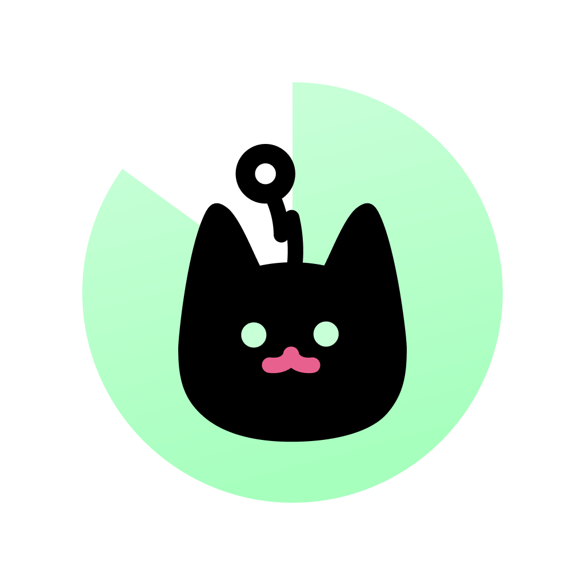

# NeowFocus 🐱⏱️

<div align="center">



**귀여운 고양이와 함께하는 뽀모도로 타이머**

[](https://www.electronjs.org/)
[](https://reactjs.org/)
[](https://www.typescriptlang.org/)
[](https://www.apple.com/app-store/)

</div>

---

## 🎯 소개

NeowFocus는 macOS용 뽀모도로 타이머 애플리케이션입니다. 집중 세션을 완료할 때마다 귀여운 고양이 발바닥 도장을 찍어가며 생산적인 하루를 만들어보세요!

### ✨ 주요 기능

- 🎯 **뽀모도로 타이머**: 25분 집중 세션으로 효율적인 시간 관리
- 🐾 **발바닥 애니메이션**: 세션 완료 시 고양이 발바닥 도장 효과
- 📌 **항상 위 모드**: 화면 최상단에 고정되는 플로팅 타이머
- 🪟 **Tiny Window**: 최소화된 미니 뷰로 공간 절약
- 🎨 **세련된 디자인**: Figma 기반 디자인 시스템 적용
- 💾 **자동 저장**: 작업 내역과 타이머 상태 자동 저장
- 🔔 **시스템 트레이**: 메뉴바 상주 및 빠른 접근
- ⌨️ **키보드 단축키**: 집중 세션 중 단축키 비활성화로 방해 최소화
- 🍎 **Mac App Store 지원**: TestFlight를 통한 베타 테스트 가능

## 🛠 기술 스택

- **프레임워크**: Electron 28.x + React 18.x
- **언어**: TypeScript 5.x
- **빌드**: Vite + electron-vite
- **스타일링**: styled-components + 테마 시스템
- **라우팅**: react-router-dom
- **패키징**: @electron/forge (Apple 공식 도구)
- **상태 관리**: React Context API + localStorage

## 시작하기

### 필수 요구사항

- Node.js 18.x 이상
- pnpm (권장) 또는 npm

### 설치 및 실행

```bash
# 의존성 설치 (pnpm 권장)
pnpm install

# 개발 서버 실행
pnpm run dev

# 또는 npm 사용
npm install
npm run dev
```

### 빌드

```bash
# 타입 체크
pnpm run typecheck

# 소스 코드 컴파일
pnpm run build

# 앱 패키징
pnpm run package

# Mac App Store 빌드 (유니버설 바이너리, 버전 자동 증가)
pnpm run build:mas

# PKG 인스톨러 생성
pnpm run build:pkg
```

### 🚀 TestFlight 배포

Mac App Store용 빌드를 생성하고 TestFlight에 자동으로 배포:

```bash
pnpm run deploy:testflight
```

**자동화된 배포 프로세스:**

1. ✨ 이전 빌드 정리
2. 🔨 Mac App Store 유니버설 바이너리 생성 (x64 + arm64)
3. 🔐 코드 서명 및 entitlements 검증
4. 📦 PKG 인스톨러 생성
5. 🚀 Transporter로 App Store Connect 업로드
6. 🔔 각 단계마다 macOS 알림 표시

**필수 준비사항:**

- [Apple Developer](https://developer.apple.com/) 계정
- **Mac App Store Distribution** 인증서 및 개인 키
- **3rd Party Mac Developer Installer** 인증서 및 개인 키
- Provisioning Profile: [build/NeowFocus_Mac_App_Store.provisionprofile](build/NeowFocus_Mac_App_Store.provisionprofile)
- [Transporter 앱](https://apps.apple.com/app/transporter/id1450874784) 설치

> **💡 Tip**: 배포 후 App Store Connect에서 빌드 처리가 완료되면 TestFlight에서 베타 테스트를 시작할 수 있습니다.

### 환경 변수

#### Mac App Store 코드 사이닝

Mac App Store 빌드를 위한 코드 사이닝 시 다음 환경 변수를 설정할 수 있습니다:

```bash
# 코드 사이닝 인증서
export CSC_NAME="Apple Distribution: Your Name (TEAM_ID)"

# 설치 패키지 서명 인증서
export CSC_INSTALLER_NAME="3rd Party Mac Developer Installer: Your Name (TEAM_ID)"

# 인증서 파일 경로 (선택사항)
export CSC_LINK="/path/to/certificate.p12"
export CSC_KEY_PASSWORD="certificate-password"

# 빌드 실행
pnpm run build:mas
```

**주의사항:**

- `.env` 파일이나 인증서 파일(`.p12`, `.cer`, `.provisionprofile` 등)은 절대 커밋하지 마세요
- 이러한 파일들은 `.gitignore`에 의해 자동으로 제외됩니다

## 📁 프로젝트 구조

```txt
NeowFocus/
├── src/
│   ├── main/                    # Electron 메인 프로세스
│   │   ├── handlers/            # 윈도우, 트레이 핸들러
│   │   │   ├── windowHandler.ts # 윈도우 관리
│   │   │   └── trayHandler.ts   # 시스템 트레이
│   │   ├── IpcProtocol.ts       # IPC 통신 프로토콜
│   │   └── index.ts             # 앱 엔트리포인트
│   ├── preload/                 # 프리로드 스크립트 (보안 브릿지)
│   └── renderer/                # React 렌더러 프로세스
│       ├── src/
│       │   ├── component/       # UI 컴포넌트
│       │   ├── context/         # React Context (상태 관리)
│       │   ├── hooks/           # 커스텀 훅
│       │   ├── page/            # 페이지 컴포넌트
│       │   │   ├── input/       # 작업 입력 페이지
│       │   │   ├── focus/       # 타이머 실행 페이지
│       │   │   └── tinyWindow/  # 미니 뷰 모드
│       │   └── styles/          # 스타일 및 테마
│       └── index.html
├── build/                       # 빌드 리소스
│   ├── Assets.xcassets/         # macOS 에셋 카탈로그
│   ├── entitlements.mas.plist   # Mac App Store Entitlements
│   └── *.provisionprofile       # Provisioning Profiles
├── scripts/                     # 빌드 및 배포 스크립트
└── out/                         # @electron/forge 빌드 결과물
```

## 🏗 아키텍처

### 프로세스 구조

Electron의 멀티 프로세스 아키텍처를 활용합니다:

- **메인 프로세스** ([src/main/](src/main/)): 윈도우 관리, 시스템 트레이, OS 레벨 상호작용
- **렌더러 프로세스** ([src/renderer/src/](src/renderer/src/)): React 기반 UI 렌더링
- **프리로드** ([src/preload/](src/preload/)): contextBridge를 통한 안전한 IPC 통신

### 상태 관리

React Context API와 localStorage를 활용한 상태 관리:

- **TaskContext**: 작업명, 타이머 상태, 지속 시간, 일시정지 상태
- **localStorage**: 세션 간 데이터 영속성 (작업 내역, 타이머 상태)
- **useLocalStorage** 커스텀 훅: 타입 안전한 로컬 스토리지 접근

### 라우팅

react-router-dom 기반 SPA 라우팅:

| 경로 | 설명 | 창 크기 |
|------|------|---------|
| `/` | 작업 입력 페이지 | 384×60px (확장 900px) |
| `/focus` | 타이머 실행 페이지 | 384×900px |
| `/tiny_window` | 미니 뷰 모드 | 384×60px (고정) |

### 테마 시스템

[src/renderer/src/styles/theme.ts](src/renderer/src/styles/theme.ts)에 정의된 중앙 집중식 테마:

- Color Palette (primary, danger, text, background)
- Container, Input, Button 컴포넌트 색상
- 다크 모드 지원을 위한 확장 가능한 구조

### Path Aliases

```typescript
@renderer/*    // src/renderer/src
@components/*  // src/renderer/src/component
@hooks/*       // src/renderer/src/hooks
@styles/*      // src/renderer/src/styles
@assets/*      // src/renderer/src/assets
```

## 🛠 개발 가이드

### 코드 품질

```bash
# Prettier로 코드 포맷팅
pnpm run format

# ESLint로 린팅 및 자동 수정
pnpm run lint

# TypeScript 타입 체크
pnpm run typecheck:node  # Node.js (main/preload)
pnpm run typecheck:web   # Web (renderer)
pnpm run typecheck       # 전체 프로젝트
```

### IPC 통신

메인 프로세스와 렌더러 프로세스 간 통신은 [src/main/IpcProtocol.ts](src/main/IpcProtocol.ts)에 정의된 프로토콜을 따릅니다.

**주요 IPC 채널:**

- `window:minimize` - 창 최소화
- `window:close` - 창 닫기
- `window:resize` - 창 크기 조정
- `window:navigate` - 라우터 네비게이션

**보안:** contextBridge를 사용하여 안전한 IPC 통신을 보장합니다.

### 빌드 시스템

**@electron/forge** 기반 빌드 파이프라인:

1. **소스 컴파일** (`electron-vite build`): TypeScript → JavaScript
2. **앱 패키징** (`@electron/forge package`): 실행 가능한 앱 생성
3. **코드 사이닝** (자동): osxSign + postPackage 훅
4. **배포 패키지 생성** (`@electron/forge make`): PKG, ZIP 등

> **참고**: 빌드 결과물은 `out/` 디렉토리에 생성됩니다 (`dist/` 아님).

## 🔧 트러블슈팅

### `electron-vite: command not found`

`NODE_ENV=production`일 때 devDependencies가 설치되지 않아 발생합니다:

```bash
unset NODE_ENV
pnpm install
```

### `out/` 디렉토리가 생성되지 않음

소스 코드를 먼저 컴파일해야 합니다:

```bash
pnpm run build
# 또는
npx electron-vite build
```

### 코드 서명 오류

**문제:** "resource fork, Finder information, or similar detritus not allowed"

**해결:**

```bash
# 확장 속성 제거
xattr -cr out/NeowFocus-darwin-universal/NeowFocus.app
```

**문제:** Provisioning profile not found

**해결:** `build/` 디렉토리에 올바른 provisioning profile이 있는지 확인하세요.

### TestFlight 업로드 실패

1. Transporter 앱에서 Apple ID로 로그인했는지 확인
2. 앱의 번들 ID가 App Store Connect와 일치하는지 확인
3. 인증서 및 프로비저닝 프로파일이 최신인지 확인

## 📄 라이선스

이 프로젝트의 라이선스 정보는 프로젝트 소유자에게 문의하세요.

## 🤝 기여

버그 리포트나 기능 제안은 이슈를 통해 제출해주세요.

---

<div align="center">

Made with ❤️ and 🐱

**[Website](https://neowfocus.app)** · **[Issues](https://github.com/your-repo/issues)** · **[Discussions](https://github.com/your-repo/discussions)**

</div>
